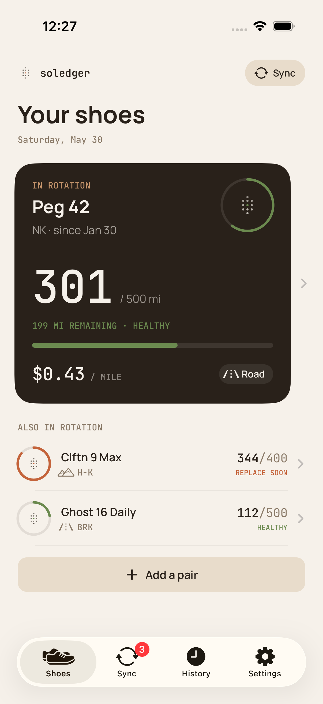

# CLAUDE.md

This file provides guidance to Claude Code (claude.ai/code) when working with code in this repository.

## What this is

Static marketing site for **Soledger** — an iOS app that tracks running shoe mileage via Apple Health. No build tool, no JavaScript framework, no package manager. Just HTML and CSS.

## Previewing locally

```bash
open index.html          # macOS: opens in default browser
python3 -m http.server   # optional: serve on localhost:8000 to test nav links
```

## File structure

| File | Purpose |
|------|---------|
| `index.html` | Main landing page (hero, features, FAQ, CTA) |
| `styles.css` | All styles — shared across every page |
| `support.html` | Support/troubleshooting page |
| `privacy.html` | Privacy policy |
| `terms.html` | Terms of service |
| `assets/app-icon.png` | App icon used in nav and `<link rel="icon">` |

## Design system

All CSS custom properties are defined at the top of `styles.css`:

| Variable | Value | Role |
|----------|-------|------|
| `--bone` | `#f6f1ea` | Page background |
| `--paper` | `#fbf6ef` | Card/surface background |
| `--ink` | `#29211a` | Primary text & dark sections |
| `--ember` | `#c4633a` | Accent / CTA / replace-soon alert color |
| `--clay` | `#c4946b` | Secondary accent (eyebrows, feature numbers) |
| `--umber` | `#8a7a68` | Secondary/muted text |
| `--moss` | `#6b8a4f` | "Healthy" indicator color |

Fonts: **Manrope** (`--font-display`) for headings/body, **JetBrains Mono** (`--font-mono`) for labels, stats, and monospaced values. Both loaded from Google Fonts.

## Screenshot placeholders

The hero phone and the 3-column gallery currently show `.slot` placeholder divs. When screenshots are ready:

- **Hero**: Replace the `<div class="slot">...</div>` inside `.phone-screen` with:
  ```html
  
  ```
- **Gallery**: Replace each `.shot > .slot` with an `` in the same style. Recommended size: 1290×2796 portrait PNG (iPhone 15 Pro Max simulator).

## App Store link

Both `href="#"` App Store badge links in `index.html` (hero and final CTA) need the real App Store URL once the app is live.

## Responsive breakpoints

- `980px` — tablet: single-column hero, features stack, gallery goes 2-column
- `640px` — mobile: full single-column, `.hide-sm` nav links hidden

## Shared nav / footer pattern

Every page duplicates the `<nav>` and `<footer>` blocks directly (no server-side includes or JS templating). When updating nav or footer copy, edit all four HTML files.

## Legal pages

`privacy.html`, `terms.html`, and `support.html` all use the `.legal` layout class from `styles.css`. The `.toc` component renders a 2-column `<ol>` grid inside a card.
